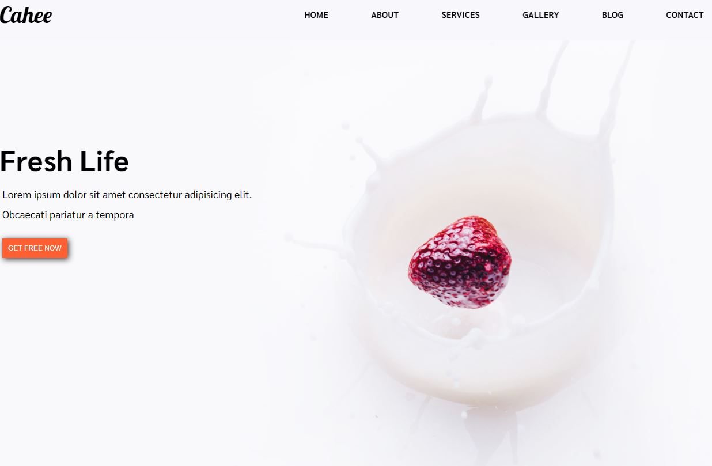
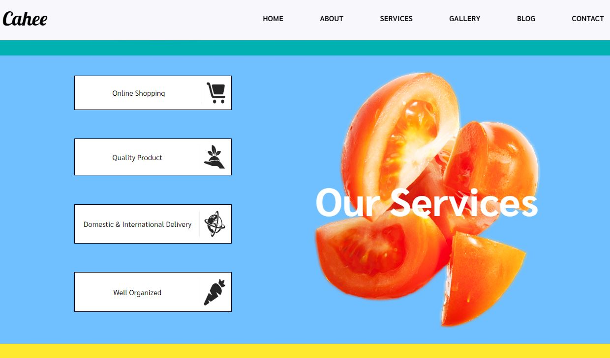

# Challenge-2 - Simply website
> This is my second project from Weekely Webdev Challenge. It is simply webstie with several sections and small gallery.

## Screenshots

## Technologies
* HTML
* CSS
* JavaScript
* RWD
* GIT
* Photoshop

## Status
Project is: done

## Inspiration
Project based on challenge from weekly webdev challenge group from Facebook.

## Contact
Created by [Damian Jackiewicz](https://www.linkedin.com/in/damian-jackiewicz/) - feel free to contact me!
